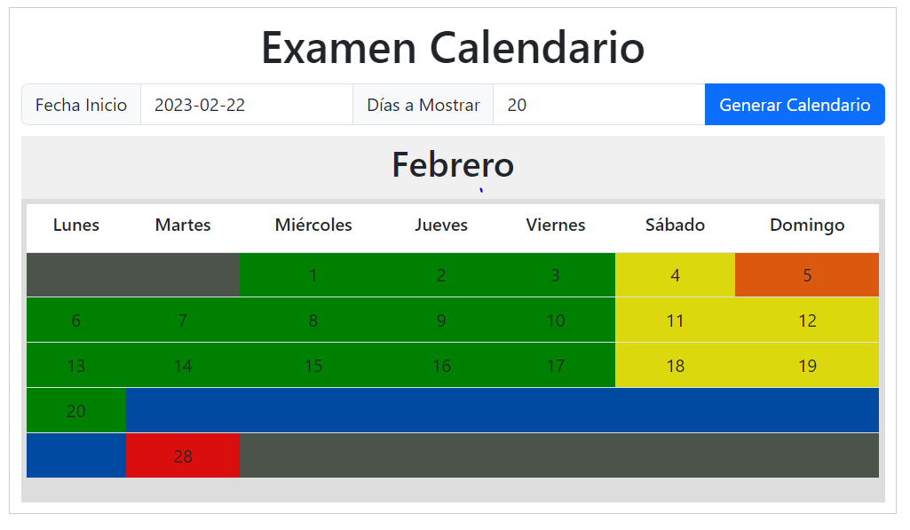
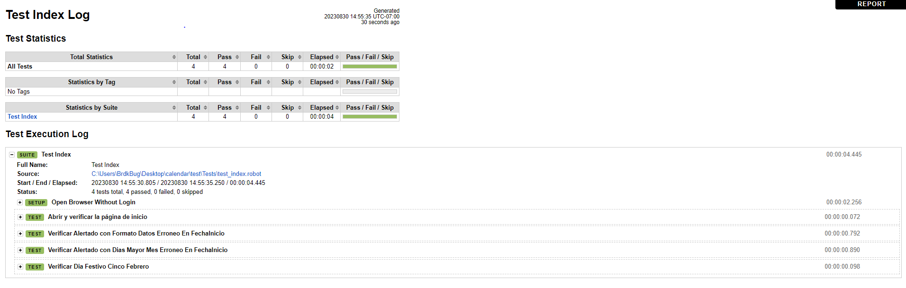

# Calendario
Examen Calendario
<!-- PROJECT LOGO -->
 

    

  

# Pruebas Automatizadas

  
  

       Comencemos
     
  

<!-- TABLE OF CONTENTS -->

  
Tabla de Contenido

  <ol>
    <li>
      <a href="#Acerca del Proyecto">Acerca del Proyecto</a>
    </li>
    <li>
      <a href="#El archivo principal>El archivo principal</a>
      <ul>
        <li><a href="#Prerrequisitos">Prerrequisitos</a></li>
        <li><a href="#TODO">TODO</a></li>
        <li><a href="#Tecnologias">Tecnologías</a></li>
      </ul>
    </li>
  </ol>

<!-- Acerca del Proyecto -->
## Acerca del Proyecto

El siguiente proyecto es una aplicación del tipo Web con que cumple con los siguientes requisitos:

* Se requieren dos datos de captura, Fecha de inicio y días a mostrar.

* Crear el calendario mensual con las semanas necesarias para mostrar los días solicitados.

* Desplegar cada mes con su encabezado con nombre de mes y días de la semana.

* No usar control de calendario predefinido.

* Los días sábado y domingo se necesitan mostrar en amarillo, los días de lunes a viernes se necesitan en color verde, y los días festivos en color naranja.

* Los días fuera de rango de la fecha se muestran en gris (cualquier día antes de la fecha de inicio, cualquier día después de la fecha de término, cualquier día antes del primer día del mes).

* Se integraron 4 pruebas: Abrir y verificar la página de inicio,   Verificar Alertado con Formato Datos Erroneo En FechaInicio, Verificar Alertado con Dias Mayor Mes Erroneo En FechaInicio, Verificar Dia Festivo Cinco Febrero.    

## El archivo principal

Solo abriendo el index.html con el explorador de su elección, en mis pruebas se utilizó  Google Chrome (Versión 116.0.5845.111 (Build oficial) (64 bits))

## Tecnologías

* HTML.
* CSS.
* JavaScript.
* RobotFramework 
* Otras Librerías (SweetAlert, Boostrap).

## Prerrequisitos

Se necesita acceso a internet porque utiliza algunas librerías externas;
Para ejecutar las pruebas se ocupa instalar python, el gestor de paquetes pip en las variables de entorno global :
~~~
 pip install robotframework
 pip install robotframework-seleniumlibrary
~~~

correr pruebas en \calendar\test\Tests:
robot test_index.robot

### TODO
- Si para el rango a mostrar se necesitan varios meses, cada mes tiene que tener su encabezado con nombre de mes y días de la semana.
- considerar Año bisiesto 2024. Desde:  lunes 1 de enero Hasta: martes 31 de diciembre
