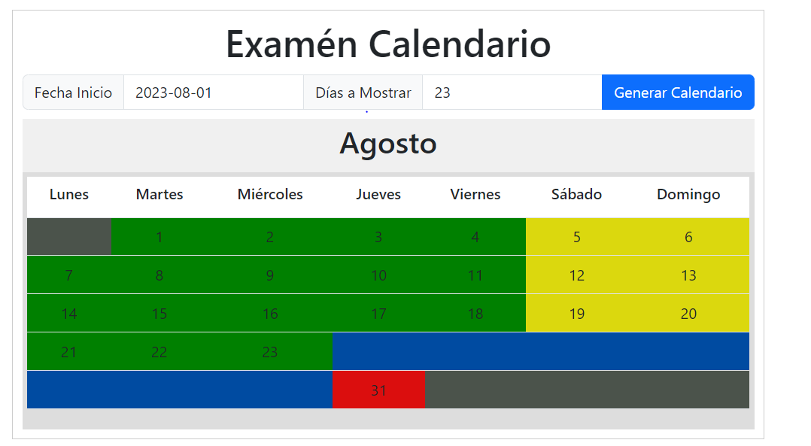

# Calendario
Examén Calendario
<!-- PROJECT LOGO -->
 

  

  

       let's go!
     
  

<!-- TABLE OF CONTENTS -->

  
Tabla de Contenido

  <ol>
    <li>
      <a href="#Acerca del Proyecto">Acerca del Proyecto</a>
    </li>
    <li>
      <a href="#getting-started">Comencemos</a>
      <ul>
        <li><a href="#prerequisites">Prerequisites</a></li>
        <li><a href="#installation">Installation</a></li>
      </ul>
    </li>
  </ol>

<!-- Acerca del Proyecto -->
## Acerca del Proyecto

El siguiente proyecto es una aplicacion del tipo Web con que cumple con los siguientes requisitos:

* Se requieren dos datos de captura, Fecha de inicio y días a mostrar.

* Crear el calendario mensual con las semanas necesarias para mostrar los días solicitados.

* Desplegar cada mes con su encabezado con nombre de mes y días de la semana.

* No usar control de calendario predefinido.

* Los días sábado y domingo se necesitan mostrar en amarillo, los días de lunes a viernes se necesitan en color verde, y los días festivos en color naranja.

* Los días fuera de rango de la fecha se muestran en gris (cualquier día antes de la fecha de inicio, cualquier día después de la fecha de término, cualquier día antes del primer día del mes).

<!-- GETTING STARTED -->
## El archivo principañ

Solo abriendo el index.html con el explorador de su eleccion, en mis pruebas utilice google chrome (Versión 116.0.5845.111 (Build oficial) (64 bits)****)

### Prerequisitoss

Se necesita acceso a internet por que utiliza algunas librerias externas  

### TODO
- Si para el rango a mostrar se necesitan varios meses cada mes tiene que tener su encabezado con nombre de mes y días de la semana.
- considerar bisiestos Año bisiesto 2024. Desde: lunes 1 de enero Hasta: martes 31 de diciembre

